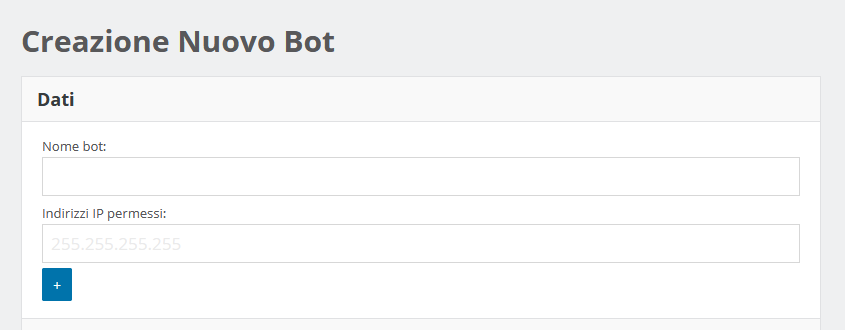
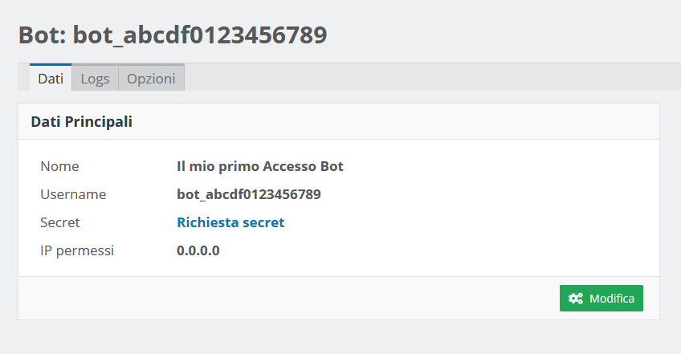
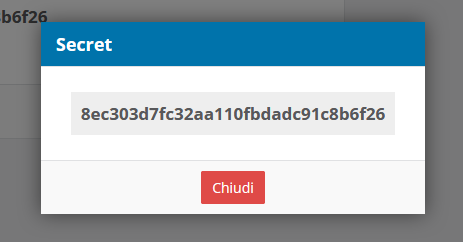

# Creazione di un Accesso API
Per creare un accesso API è necessario accedere alla propria *Area  Supplier* e navigare nel pannello *Bot*.  
Nel pannello bisogna cliccare sul bottone *Crea un Bot*.

### Pannello di creazione Bot
Assegnare un **nome** al bot e impostare gli **indirizzi IP** che sono autorizzati a connettersi.

> **_NOTA_**  
> Il *nome del bot*  può essere deciso arbitrariamente, non verrà usato per effettuare la connessione.

### Scheda Bot
Al termine della creazione si potrà consultare la scheda del BOT che mostrerà i dati salienti dell'accesso appena creato.

Per accedere via API sono necessari la username e la password, lo *username* è quello visualizzato in questa pagina, mentre per ottenere la password è necessario cliccare sul link ***richiesta secret***.

Terminata questa procedura avrete sia lo username che la password per completare l'accesso via API.

