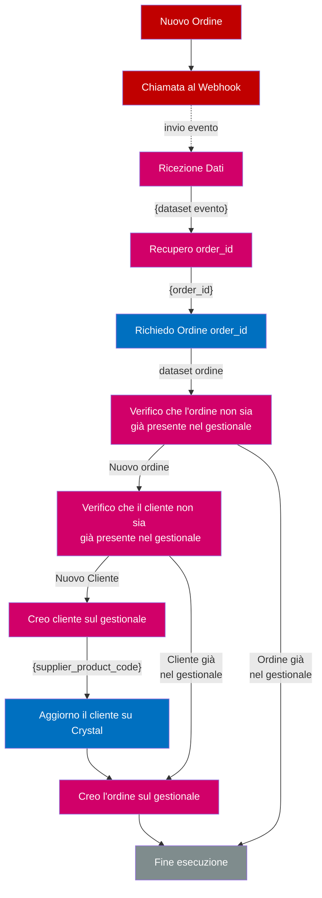

# Come sincronizzare gli Ordini effettuati su Crystal
In questo tutorial affronteremo come ricevere gli ordini effettuati su Crystal nel proprio gestionale.
I passaggi saranno i seguenti:
- creare un Webhook per ricevere gli eventi
- sincronizzare gli *Ordini*


                                    
## Creare un Webhook per ricevere gli Eventi
Per poter sincronizzare gli ordini ricevuti mediante Crystal sul proprio gestionale
è necessario che venga svolta un'azione di sincronizzazione ogni qualvolta si genera
un evento *nuovo ordine*, per farlo useremo i Webhook.  
I Webhook sono chiamate ad indirizzi web che vengono effettuate a seguito di un evento.
Pertanto creando un webhook, verrà effettuata una chiamata web al vostro gestionale
ogni qualvolta un ordine viene creato o modificato.

Per creare un Webhook si rimanda alla guida dedicata.
TODO -> inserire link alla guida

## Ricezione Evento *Nuovo Ordine*
Una volta impostata la Webcall riceveremo una chiamata web ogni qualvolta
viene svolta una azione su un ordine. Riceveremo l'input via **POST**.
L'input che riceveremo sarà strutturato come segue:

```json
{
	"webhook_id": 1,
	"webhook_name": "Webhook Gestionale A",
	"event_id": 26,
	"event_url": "https://test.my.erp.com/crystal/receive",
	"module": "orders",
	"action": "create",
	"dataset": {
	  "order_id": 6
	},
	"date_created": "2020-11-30 18:43:44",
}
```

Come è possibile vedere le informazioni passate sono lo stretto necessario.
Crystal infatti non invia tutti i dati dell'ordine ma si limita ad inviare
solo l' `order_id`.

> **NOTA BENE**  
> Crystal utilizza una logica di sicurezza *Zero-Trust*. Questa logica
> presume che ogni sistema informativo non possa fidarsi pienamente
> della sua controparte.
> In questo caso ad esempio Crystal non può essere certo che chi riceverà
> i dati dell'ordine sia effettivamente il server del gestionale del
> distributore. La chiamata web potrebbe essere intercettata,
> esser manipolata e quindi riformulata diversamente per ingannare il gestionale
> del distributore con dati alterati.
> Per questa ragione viene inviato solo il codice ordine.
> Sarà il gestionale del distributore che dovrà richiedere i la visura completa
> di tutti i dati dell'ordine effettuando una chiamata protetta via **API**.

## Scaricamento dei dati dell'ordine
Nel punto precedente abbiamo ricevuto l'`order_id` del nuovo ordine.
Questo è tutto ciò che serve per poter effettuare una callback a Crystal e scaricare
tutto il dataset dell'ordine.

Inviamo il comando:
**orders**->**get**  
```json
{
	"order_id": 1,
    "store_id": 1,
    "store_token": "store_41385043618c9d65",
    "store_name": "Sari Spazio",
    "supplier_buyer_name": "Cliente Tal dei tali SpA",
    "supplier_buyer_code": "XXXX00001",
    "buyer_id": 1,
    "buyer_token": "buyer_ea1301474130071a",
    "agent_id": null,
    "agent_token": null,
    "agent_name": null,
    "brand_id": 1,
    "brand_name": "My Brand",
    "collection_id": 2,
    "collection_name": "Autunno Inverno 2021",
	"address_id": 1,
    "address_street": "Piazza Italia",
    "address_street_number": "1",
    "address_city": "Milano",
    "address_province": "MI",
    "address_postalcode": "20122",
    "address_countrycode": "IT",
    "tod_id": 1,
    "tod_name": "Termini di spedizione",
    "tod_content": "Spediremo tutto il prima possibile, non continuate a chiamare.",
    "top_id": 1,
    "top_name": "Termini di pagamento",
    "top_content": "- 30 giorni - 50%&lt;br /&gt;- 60 giorni - saldo integrale",
    "tos_id": 1,
    "tos_name": "Termini e condizioni del Servizio",
    "tos_content": "Noi vi inviamo la merce e voi ci pagate",
    "pricelist_id": 5,
    "cart_id": null,
    "notes": null,
    "cache_price": 140,
    "cache_discount": 0,
    "cache_net": 140,
    "cache_vat": 30.8,
    "cache_gross": 170.8,
    "total_items": 3,
    "is_approved": 0,
    "is_brand_approved": 0,
    "is_sent": 0,
    "is_delivered": 0,
    "is_paid": 0,
    "is_deleted": 0,
    "date_created": "2020-11-22 23:37:36",
    "date_approved": null,
    "date_brand_approved": null,
    "date_sent": null,
    "date_delivered": null,
    "date_paid": null,
    "date_deleted": null,
    "products_sku_list": "21,22,23",
    "items": {
      "1": {
        "order_id": 1,
        "order_item_id": 1,
        "sku_id": 23,
        "brand_name": "My Brand",
        "brand_id": 1,
        "product_id": 5,
        "product_name": "Maglietta 001",
        "product_type": "t-shirt",
        "product_code": "Tshirt-001",
        "product_gender": null,
        "product_target": "adult",
        "product_version_id": 5,
        "product_version_hash": "900eea49ace741ab2dbde40d1ab8fa69",
        "color_id": 4,
        "color_name": "Blu Elettrico molto ma davvero tanto l",
        "color_code": "BLUE001",
        "color_rgb": "0000FF",
        "fabric_id": 4,
        "fabric_name": "AC100%",
        "fabric_code": "ACRYLIC",
        "size_id": "18",
        "size_type": "international",
        "size_name": "300",
        "quantity": 1,
        "unit_price": 10,
        "unit_discount": 0,
        "agent_discount": 0,
        "vat_rate": 0
      },
      "2": {
        "order_id": 1,
        "order_item_id": 2,
        "sku_id": 22,
        "brand_name": "My Brand",
        "brand_id": 1,
        "product_id": 5,
        "product_name": "Maglietta 001",
        "product_type": "t-shirt",
        "product_code": "Tshirt-001",
        "product_gender": null,
        "product_target": "adult",
        "product_version_id": 5,
        "product_version_hash": "900eea49ace741ab2dbde40d1ab8fa69",
        "color_id": 4,
        "color_name": "Blu Elettrico molto ma davvero tanto l",
        "color_code": "BLUE001",
        "color_rgb": "0000FF",
        "fabric_id": 4,
        "fabric_name": "AC100%",
        "fabric_code": "ACRYLIC",
        "size_id": "17",
        "size_type": "international",
        "size_name": "200",
        "quantity": 2,
        "unit_price": 20,
        "unit_discount": 0,
        "agent_discount": 0,
        "vat_rate": 0
      },
      "3": {
        "order_id": 1,
        "order_item_id": 3,
        "sku_id": 21,
        "brand_name": "My Brand",
        "brand_id": 1,
        "product_id": 5,
        "product_name": "Maglietta 001",
        "product_type": "t-shirt",
        "product_code": "Tshirt-001",
        "product_gender": null,
        "product_target": "adult",
        "product_version_id": 5,
        "product_version_hash": "900eea49ace741ab2dbde40d1ab8fa69",
        "color_id": 4,
        "color_name": "Blu Elettrico molto ma davvero tanto l",
        "color_code": "BLUE001",
        "color_rgb": "0000FF",
        "fabric_id": 4,
        "fabric_name": "AC100%",
        "fabric_code": "ACRYLIC",
        "size_id": "16",
        "size_type": "international",
        "size_name": "100",
        "quantity": 3,
        "unit_price": 30,
        "unit_discount": 0,
        "agent_discount": 0,
        "vat_rate": 0
      }
    },
  }
```

## Logica di sincronizzazione
Una volta ricevuto il dataset dell'ordine siamo in grado di determinare
le seguenti condizioni:
- se l'ordine non sia già stato scaricato da un precedente comando
- se il buyer connesso all'ordine sia presente sul gestionale

Nel caso il Buyer non fosse presente bisognerà procedere con la sincronizzazione
dello stesso usando una chiamata **suppliersBuyers**->**get**();
In merito alla sincronizzazione dei Buyer si raccomanda di leggere il tutorial dedicato.

