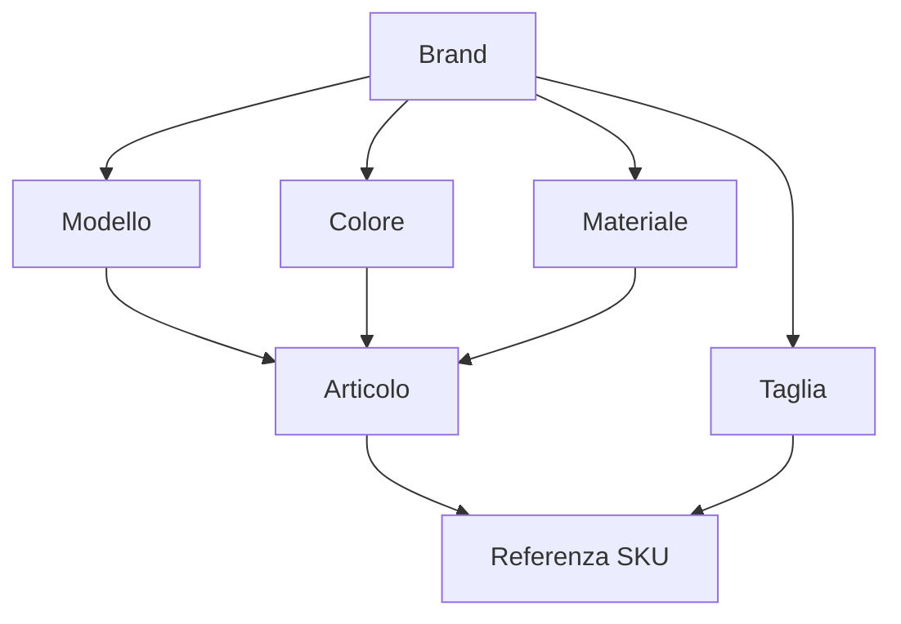
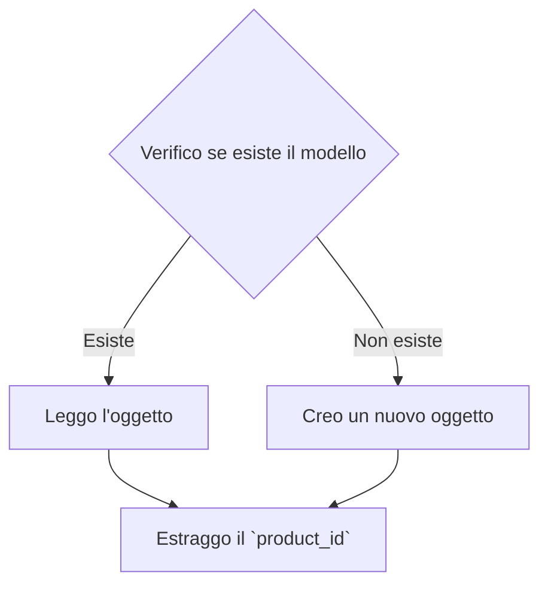

# Come sincronizzare il Catalogo Prodotti
In questo tutorial affronteremo come fare ad importare i prodotti dentro a Crystal.
Per creare correttamente una referenza sarà necessario creare tutti gli oggetti
di seguito descritti in questo diagramma:



I passaggi saranno i seguenti:

- creazione *Modello*
- creazione *Colore*
- creazione *Materiale*
- creazione *Articolo*
- creazione *Cartella Taglie*
- creazione *Referenza SKU*

### Creazione Modello

Per importare un modello è necessario seguire il seguente flusso:



Iniziamo verificando se il modello sia già presente in archivio.
Per farlo possiamo effettuare una ricerca esatta
sul campo `product_code` (Il codice identificativo usato dal produttore) e quindi
recuperare il codice `product_id` usato da Crystal.

> **Nota bene**  
> In caso si debba effettuare l'importazione di un numero importante di referenze
> potrebbe essere una buona idea scaricare l'intero database *Modelli* per usarlo
> come cache locale durante il processo di creazione

Con il seguente comando effettueremo una ricerca sul database per product_code.
Comando: **products**->**list**  
Richiesta:  
```js
{
	q : {
		"product_code" : "99999",
	}
}
```

Ipotiziamo che l'oggetto non sia stato creato.
In questo caso riceveremo una risposta simile alla seguente:

```js
{
	nav : {
		"page" : 1,
		"tot_pages" : 0,
		"results" : 10,
		"tot_results" : 0,
		"orderBy": 	"product_id|DES" 
	},
	dataaset: []
}
```
A questo punto possiamo procedere alla creazione del nuovo Modello.
Inviamo il seguente comando.  
Comando: **products**->**create**  
Richiesta:  
```js
{
	"brand_id" : 1,
    "product_name"   : "Modello Alpha",
    "product_code"   : "99999",
    "product_type"   : "shoes",
	"product_gender" : "man",
	"product_target" : "adult"
	"is_visible"     : 1
}
```
Risposta:  
```js
{
	"brand_id"		  : 1,
	"brand_name"	  : "My Brand",
    "product_id"      : 1,
    "product_name"    : "Modello Alpha",
    "product_code"    : "99999",
    "product_type"    : "shoes",
	"product_gender"  : "man",
	"product_target"  : "adult"
	"lang_translated" : null
	"version_count"   : 0
	"skus_count"      : 0
	"is_visible"      : 1
	"date_created"    : "2020-11-11 10:52:53",
}
```
