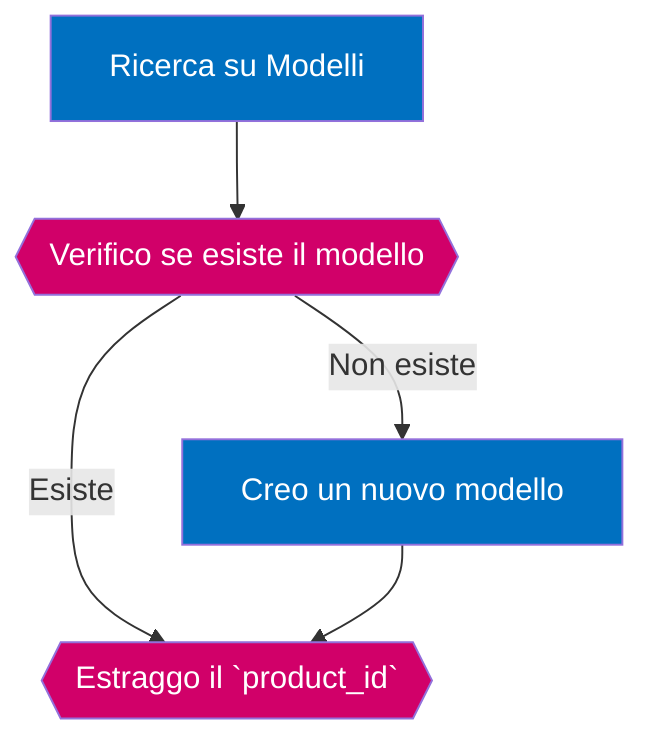
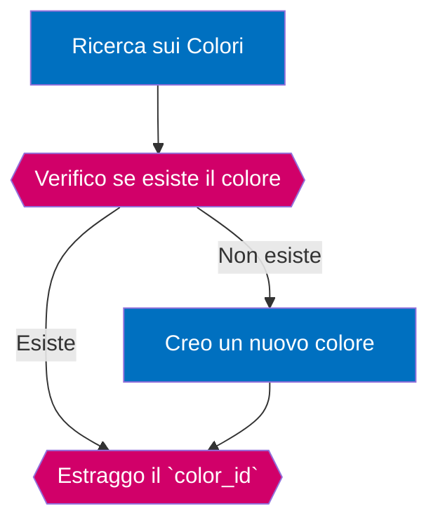
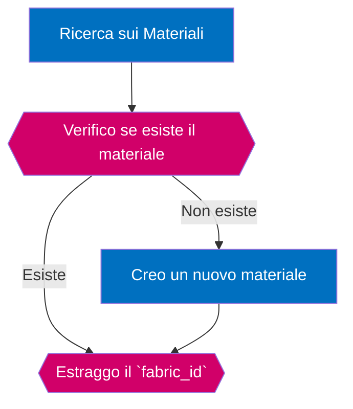
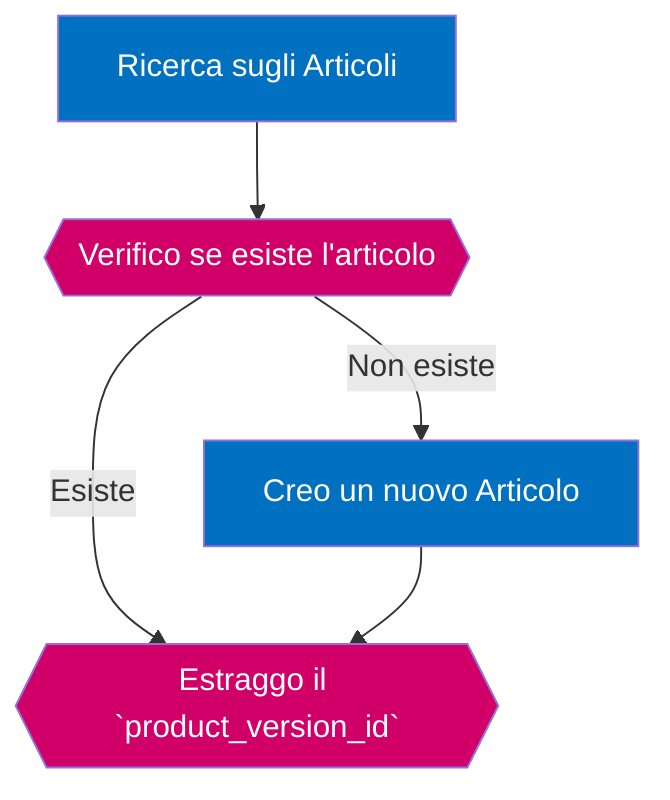
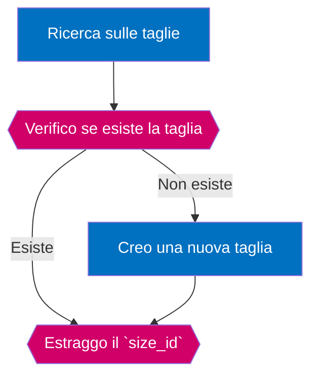

# Come sincronizzare il Catalogo Prodotti
In questo tutorial affronteremo come fare ad importare i prodotti dentro a Crystal.
Per creare correttamente una referenza sarà necessario creare tutti gli oggetti
di seguito descritti in questo diagramma:


I passaggi saranno i seguenti:

- creazione *Modello*
- creazione *Colore*
- creazione *Materiale*
- creazione *Articolo*
- creazione *Cartella Taglie*
- creazione *Referenza SKU*

## Creazione Modello

Per importare un modello è necessario seguire il seguente flusso:



Iniziamo verificando se il modello sia già presente in archivio.
Per farlo possiamo effettuare una ricerca esatta
sul campo `product_code` (Il codice identificativo usato dal produttore) e quindi
recuperare il codice `product_id` usato da Crystal.

> **Nota bene**  
> In caso si debba effettuare l'importazione di un numero importante di referenze
> potrebbe essere una buona idea scaricare l'intero database *Modelli* per usarlo
> come cache locale durante il processo di creazione

Con il seguente comando effettueremo una ricerca sul database per product_code.
Comando: **products**->**list**  
Richiesta:  
```json
{
	q : {
		"product_code" : "99999",
	}
}
```

Ipotizziamo che l'oggetto non sia stato creato.
In questo caso riceveremo una risposta simile alla seguente:

```json
{
	nav : {
		"page" 			: 1,
		"tot_pages" 	: 0,
		"results"		: 10,
		"tot_results" 	: 0,
		"orderBy"		: "product_id|DES" 
	},
	dataset: []
}
```
A questo punto possiamo procedere alla creazione del nuovo Modello.
Inviamo il seguente comando.  
Comando: **products**->**create**  
Richiesta:  
```json
{
	"brand_id" : 1,
    "product_name"   : "Modello Alpha",
    "product_code"   : "99999",
    "product_type"   : "shoes",
	"product_gender" : "man",
	"product_target" : "adult"
	"is_visible"     : 1
}
```
Risposta:  
```json
{
	"brand_id"		  : 1,
	"brand_name"	  : "My Brand",
    "product_id"      : 1,
    "product_name"    : "Modello Alpha",
    "product_code"    : "99999",
    "product_type"    : "shoes",
	"product_gender"  : "man",
	"product_target"  : "adult",
	"lang_translated" : null,
	"version_count"   : 0,
	"skus_count"      : 0,
	"is_visible"      : 1,
	"date_created"    : "2020-11-11 10:52:53"
}
```
_____________________________________________________________________________________________
## Creazione Colore

Per importare un colore è necessario seguire il seguente flusso:



Iniziamo verificando se il colore sia già presente in archivio.
Per farlo possiamo effettuare una ricerca esatta
sul campo `color_code` (Il codice identificativo usato dal produttore) e quindi
recuperare il codice `color_id` usato da Crystal.

> **Nota bene**  
> In caso si debba effettuare l'importazione di un numero importante di referenze
> potrebbe essere una buona idea scaricare l'intero database *Colori* per usarlo
> come cache locale durante il processo di creazione

Con il seguente comando effettueremo una ricerca sul database per product_code.
Comando: **productsColors**->**list**  
Richiesta:  
```json
{
	q : {
		"color_code" : "AAC123"
	}
}
```

Ipotizziamo che l'oggetto non sia stato creato.
In questo caso riceveremo una risposta simile alla seguente:

```json
{
	nav : {
		"page" 			: 1,
		"tot_pages" 	: 0,
		"results"		: 10,
		"tot_results" 	: 0,
		"orderBy"		: "color_id|DES" 
	},
	dataset: []
}
```
A questo punto possiamo procedere alla creazione del nuovo Colore.
Inviamo il seguente comando.  
Comando: **productsColors**->**create**  
Richiesta:  
```json
{
	"brand_id" 		: 1,
    "color_code"   	: "Gee3",
    "color_name"   	: "Grigio",
	"color_rgb" 	: "#626b5b"
}
```
Risposta:  
```json
{
	"brand_id"		: 1,
	"brand_name"	: "My Brand",
    "color_id"      : 1,
    "color_code"    : "Gee3",
    "color_name"    : "Grigio",
    "color_rgb"		: "#626b5b",
	"is_deleted"	: 0,
	"date_created"  : 2020-11-26 12:18:02,
	"date_deleted"	: null
}
```
_____________________________________________________________________________________________
## Creazione Materiale

Per importare un materiale è necessario seguire il seguente flusso:



Iniziamo verificando se il materiale sia già presente in archivio.
Per farlo possiamo effettuare una ricerca esatta
sul campo `fabric_code` (Il codice identificativo usato dal produttore) e quindi
recuperare il codice `fabric_id` usato da Crystal.

> **Nota bene**  
> In caso si debba effettuare l'importazione di un numero importante di referenze
> potrebbe essere una buona idea scaricare l'intero database *Materiali* per usarlo
> come cache locale durante il processo di creazione

Con il seguente comando effettueremo una ricerca sul database per fabric_code.
Comando: **productsFabrics**->**list**  
Richiesta:  
```json
{
	q : {
		"fabric_code" : "L4n4"
	}
}
```

Ipotizziamo che l'oggetto non sia stato creato.
In questo caso riceveremo una risposta simile alla seguente:

```json
{
	nav : {
		"page" 			: 1,
		"tot_pages" 	: 0,
		"results"		: 10,
		"tot_results" 	: 0,
		"orderBy"		: "fabric_id|DES" 
	},
	dataset: []
}
```
A questo punto possiamo procedere alla creazione del nuovo Materiale.
Inviamo il seguente comando.  
Comando: **productsFabrics**->**create**  
Richiesta:  
```json
{
	"brand_id" 				: 1,
    "fabric_code"   		: "L4n4",
    "fabric_name"   		: "LanaGrezza",
	"fabric_description" 	: "Lana grezza ma morbidissima"
}
```
Risposta:  
```json
{
	"brand_id"			: 1,
	"brand_name"		: "My Brand",
    "fabric_id"      	: 2,
    "fabric_code"    	: "L4n4",
    "fabric_name"    	: "LanaGrezza",
	"fabric_description": "Lana grezza ma morbidissima",
	"is_deleted"		: 0,
	"date_created"  	: 2020-11-26 12:18:02,
	"date_deleted"		: null,
	"date_updated" 		: null
}
```
_____________________________________________________________________________________________
## Creazione Articolo

Per importare un articolo è necessario seguire il seguente flusso:



Iniziamo verificando se l'articolo sia già presente in archivio.
Per farlo possiamo effettuare una ricerca esatta
sui campi `product_id`, `color_id`, `fabric_id` (che ci siamo salvati in precedenza) e quindi
recuperare il codice `product_version_id` usato da Crystal.

> **Nota bene**  
> In caso si debba effettuare l'importazione di un numero importante di referenze
> potrebbe essere una buona idea scaricare l'intero database *Articoli* per usarlo
> come cache locale durante il processo di creazione

Con il seguente comando effettueremo una ricerca sul database per sapere se esiste già la variante di quell'articolo.
Comando: **productsVersions**->**list**  
Richiesta:  
```json
{
	q : {
		"product_id"	: 1,
		"color_id" 		: 1,
		"fabric_id" 	: 2
	}
}
```

Ipotizziamo che l'oggetto non sia stato creato.
In questo caso riceveremo una risposta simile alla seguente:

```json
{
	nav : {
		"page" 			: 1,
		"tot_pages" 	: 0,
		"results"		: 10,
		"tot_results" 	: 0,
		"orderBy"		: "product_version_id|DES" 
	},
	dataset: []
}
```
A questo punto possiamo procedere alla creazione del nuovo Articolo.
Inviamo il seguente comando.  
Comando: **productsVersions**->**create**  
Richiesta:  
```json
{
	"product_id"	: 1,
	"color_id" 		: 1,
	"fabric_id" 	: 2
}
```
Risposta:  
```json
{
	"brand_id" 				: 1,
	"brand_name" 			: "My Brand",
	"color_id" 				: 1,
	"color_code" 			: "Gee3",
    "color_name" 			: "Grigio",
    "color_rgb" 			: "#626b5b",
    "fabric_id" 			: 2,
	"fabric_code" 			: "L4n4",
    "fabric_name" 			: "LanaGrezza",
	"product_id" 			: 1,
	"product_name"			: "Modello Alpha",
    "product_name_full" 	: "Modello Alpha - LanaGrezza - Grigio",
    "product_type" 			: "shoes",
    "product_target" 		: "adult",
	"product_code" 			: "99999",
	"product_gender" 		: "man",
    "product_version_hash" 	: "849117eb849d17c29d2b4aa723e41560",
	"product_version_id"	: 1,
	"images_list" 			: null,
    "sku_list"				: null,
    "is_product_visible"	: 1,
    "is_brand_deleted" 		: 0,
    "is_product_deleted"	: 0,
    "is_fabric_deleted"		: 0,
    "is_color_deleted" 		: 0,
    "is_version_deleted"	: 0,
	"date_created"			: "2020-11-26 12:46:01",
	"date_deleted" 			: null,
    "date_dismissed" 		: null,
}
```
_____________________________________________________________________________________________
## Creazione Taglia

Per importare una taglia è necessario seguire il seguente flusso:



Iniziamo verificando se la taglia sia già presente in archivio.
Per farlo possiamo effettuare una ricerca esatta
sui campi `brand_id`, `size_name`, `size_type` e quindi
recuperare il codice `size_id` usato da Crystal.

> **Nota bene**  
> In caso si debba effettuare l'importazione di un numero importante di referenze
> potrebbe essere una buona idea scaricare l'intero database *Taglie* per usarlo
> come cache locale durante il processo di creazione

Con il seguente comando effettueremo una ricerca sul database per sapere se esiste già la taglia.
Comando: **productsSizes**->**list**  
Richiesta:  
```json
{
	q : {
		"brand_id"	: 1,
		"size_name" : "27XL",
		"size_type" : "Taglie forti"
	}
}
```

Ipotizziamo che l'oggetto non sia stato creato.
In questo caso riceveremo una risposta simile alla seguente:

```json
{
	nav : {
		"page" 			: 1,
		"tot_pages" 	: 0,
		"results"		: 10,
		"tot_results" 	: 0,
		"orderBy"		: "size_id|DES" 
	},
	dataset: []
}
```
A questo punto possiamo procedere alla creazione della nuova Taglia.
Inviamo il seguente comando.  
Comando: **productsSizes**->**create**  
Richiesta:  
```json
{
	"brand_id"	: 1,
	"size_type" : "Taglie forti",
	"size_name" : "27XL"
}
```
Risposta:  
```json
{
	"brand_id" 				: 1,
	"brand_name" 			: "My Brand",
	"position" 				: 0,
	"size_id" 				: 2,
	"size_hash"				: "Taglie forti@27XL",
	"size_name" 			: "27XL",
	"size_type" 			: "Taglie forti"
	"is_deleted"			: 0,
	"date_created"			: "2020-11-26 12:46:01",
	"date_deleted" 			: null,
}
```